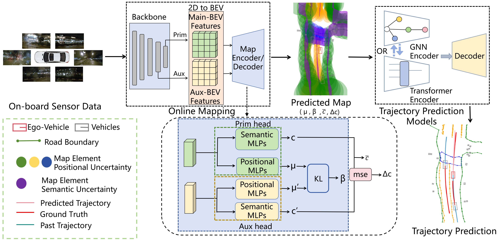

<div align="center">

# Uncertainty-Aware Trajectory Prediction
### A Unified Framework Harnessing Positional and Semantic Uncertainties

[](<ARXIV_LINK>)

**Jintao Sun, Hu Zhang, Gangyi Ding, Zhedong Zheng**

</div>

---

## 📌 Overview

Trajectory prediction in autonomous driving heavily depends on the quality of online HD maps. In real-world driving, however, map estimation inevitably suffers from noise caused by sensor limitations, occlusions, and imperfect scene understanding. These errors can propagate to downstream trajectory prediction and degrade reliability.

This repository presents our uncertainty-aware trajectory prediction framework, which explicitly models two complementary forms of map uncertainty:

- **Positional Uncertainty**: captures spatial inaccuracies in estimated map elements.
- **Semantic Uncertainty**: captures ambiguity in semantic classification of map elements.

Our method adopts a **dual-head architecture** to estimate these two uncertainties in an end-to-end manner, and injects them into downstream trajectory prediction models as enriched map representations. This design improves robustness while remaining compatible with existing online mapping and forecasting pipelines.

<p align="center">
  
</p>

---

## ✨ Highlights

- **Unified uncertainty modeling** for both positional and semantic errors in online HD maps.
- **Dual-head uncertainty estimation** with end-to-end integration into trajectory prediction.
- **Plug-and-play compatibility** with multiple online map estimation and trajectory prediction backbones.
- **Consistent improvements on nuScenes**, demonstrating stronger robustness under noisy map conditions.

---

## 📊 Main Results

We evaluate the proposed method on the **nuScenes** dataset with:

- **4 online HD map estimation methods**:
  - MapTR
  - MapTRv2
  - MapTRv2-Centerline
  - StreamMapNet

- **2 trajectory prediction backbones**:
  - HiVT
  - DenseTNT

Our method consistently improves downstream trajectory prediction performance across multiple settings. In particular:

- With **MapTRv2-Centerline + HiVT**, our method improves:
  - **minADE by 8%**
  - **minFDE by 10%**
  - **MR by 22%**

- Across DenseTNT-based settings, the largest gain reaches:
  - **13% reduction in minADE**

These results indicate that explicitly modeling both positional and semantic uncertainties provides more reliable map representations for trajectory forecasting.

---

## 🚀 Repository Status

We are currently organizing the codebase for clarity and reproducibility. This repository will include:

- [ ] Environment setup instructions
- [ ] Data preprocessing pipeline
- [ ] Training code
- [ ] Evaluation scripts
- [ ] Visualization tools
- [ ] Pretrained checkpoints

**Code and models will be released soon.**

---

## 🧠 Method Summary

Our framework first extracts BEV features from multi-view camera inputs, then applies a dual-head design to estimate map element predictions from complementary feature levels. The disagreement between the two heads is used to characterize uncertainty:

- **Positional uncertainty** is derived from the divergence between location predictions.
- **Semantic uncertainty** is derived from the discrepancy between classification scores.

These uncertainty-aware map features are then concatenated with map representations and fed into downstream trajectory predictors, enabling more robust scene understanding and motion forecasting.

---

## 📚 Citation

If you find this work helpful, please consider citing:

```bibtex
@article{sun_uncertainty_trajectory_prediction,
  title={Uncertainty-Aware Trajectory Prediction: A Unified Framework Harnessing Positional and Semantic Uncertainties},
  author={Sun, Jintao and Zhang, Hu and Ding, Gangyi and Zheng, Zhedong},
  journal={arXiv preprint arXiv:XXXX.XXXXX},
  year={XXXX}
}
